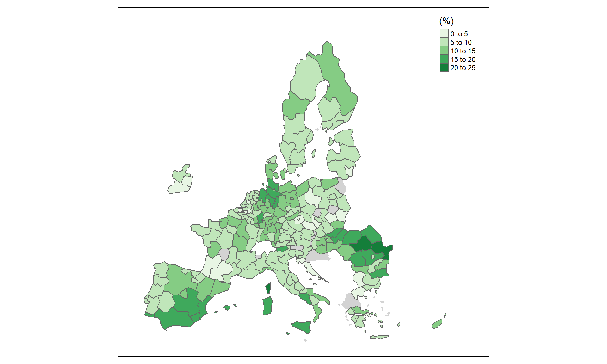
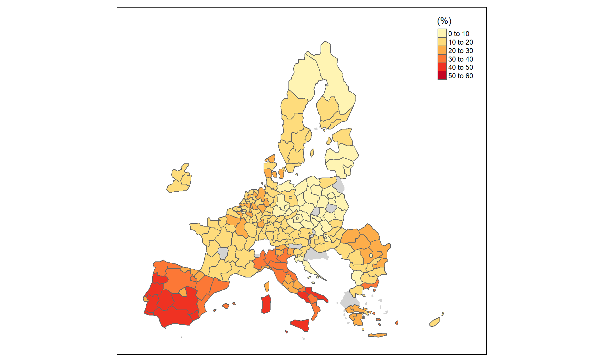
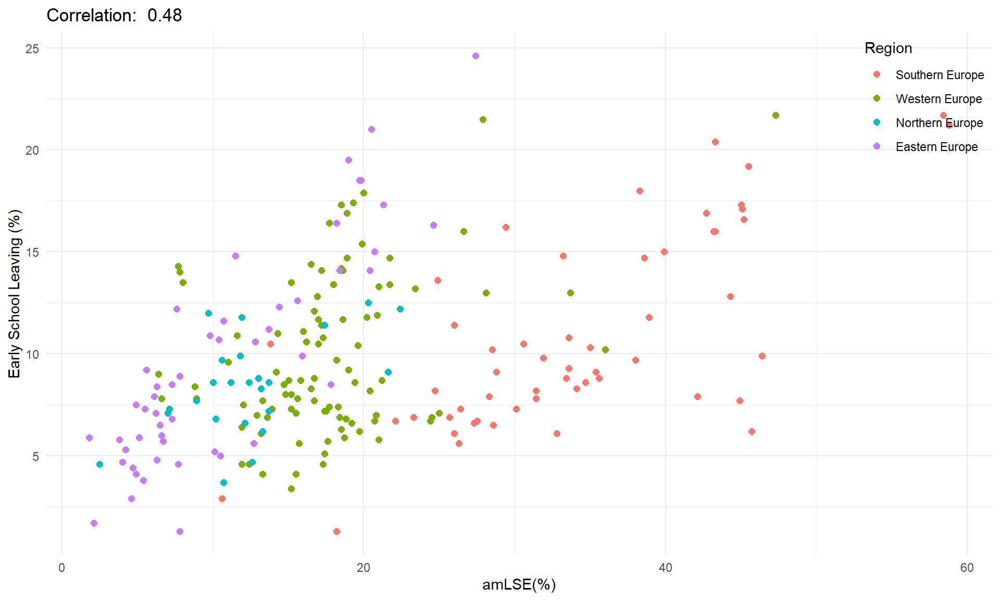
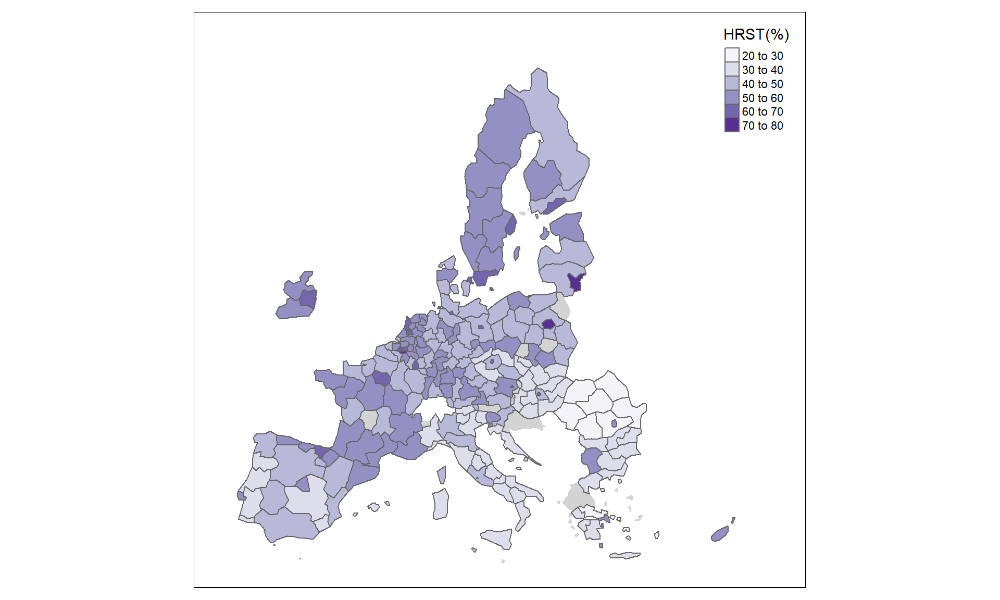
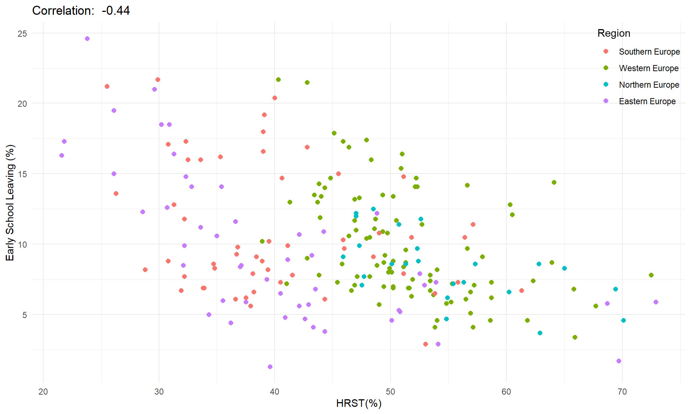
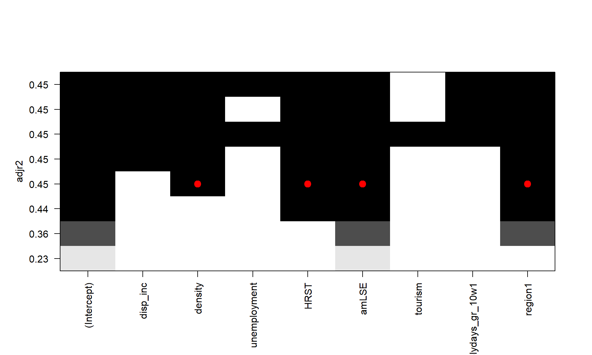
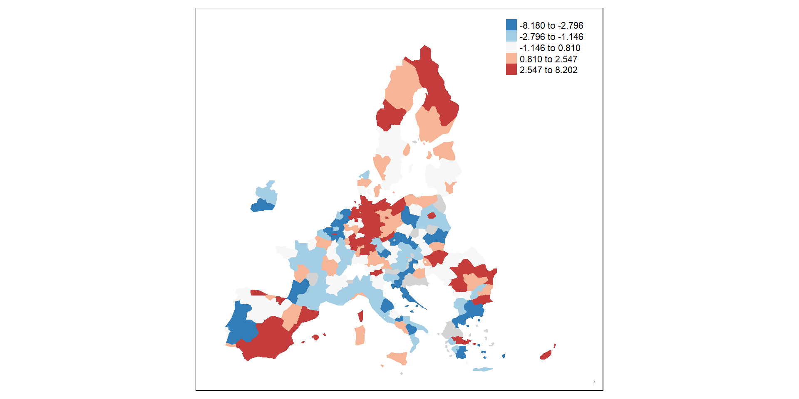

# Causes of Early School Leaving in the EU

This project investigates the regional determinants of early school leaving (ESL) in the European Union through exploratory data analysis, spatial visualization, and multiple linear regression models.

The analysis uses NUTS 2 regions as observational units and studies how socioeconomic, educational, demographic, and regional variables relate to the percentage of people aged 18-24 who left education or training early.

## Objective

The goal is to identify which measurable regional factors are most strongly associated with early school leaving in the EU. The project compares individual regressions, full multiple models, feasible generalized least squares, sampled models, best-subset selection, and diagnostic checks before arriving at a more parsimonious final model.

## Data

The dataset combines Eurostat regional data with NUTS 2 geospatial information. The main response variable is the percentage of early leavers from education and training. Predictors include:

- mean disposable income;
- population density;
- unemployment rate;
- human resources in science and technology (HRST);
- percentage of adults over 25 with at most lower secondary education (amLSE);
- tourism intensity;
- school holiday duration;
- Southern Europe regional membership.

Missing values were imputed by looking back through previous years when possible, mainly from 2023 back to 2018.

## Method

The analysis pipeline is implemented in R:

1. collecting and preparing Eurostat and NUTS 2 regional data;
2. building maps and exploratory plots for the response and predictors;
3. fitting simple regression models for individual explanatory variables;
4. estimating a full multiple regression model;
5. checking residual normality, heteroscedasticity, autocorrelation, and multicollinearity;
6. testing FGLS as a correction for heteroscedasticity;
7. using random samples to reduce spatial autocorrelation;
8. applying best-subset selection;
9. estimating a final reduced model and validating it through repeated samples.

## Main Results

### Early School Leaving Across Europe

The spatial distribution of ESL shows strong regional differences across Europe, with higher values concentrated in specific southern and peripheral areas.

### Adult Educational Attainment

The percentage of adults over 25 with at most lower secondary education is one of the strongest predictors of ESL. Regions with lower adult educational attainment tend to show higher dropout rates.

### Human Resources in Science and Technology

HRST has a negative relationship with early school leaving: regions with a larger share of people employed in or educated for science and technology tend to have lower ESL rates.

### Model Selection

Best-subset selection supports a reduced model focused on population density, adult lower secondary education, HRST, and Southern Europe regional membership. This reduced model keeps the analysis interpretable while preserving explanatory power.

### Final Model Diagnostics

Residual mapping and repeated sampled models were used to assess model stability. The final model performs more reliably after addressing heteroscedasticity and spatial dependence concerns through model reduction and sampling checks.

## Main Findings

The strongest positive predictor is the share of adults with at most lower secondary education, suggesting that the broader educational environment of a region matters for student outcomes. HRST is negatively associated with ESL, indicating that regions with stronger science and technology profiles tend to have lower dropout rates. Population density has a smaller positive association, while Southern European regions show structural differences that require careful interpretation alongside the other covariates.

## Main Files

- `dataset.R`: data collection, cleaning, imputation, and dataset construction.
- `explorative_analysis.R`: exploratory maps and visual analysis.
- `model.R`: regression modeling, diagnostics, model selection, and validation.
- `report.qmd`: Quarto report source.
- `data/`: prepared regional datasets used by the analysis.
- `riferimenti/references.bib`: bibliography for the report.

## Presentation Materials

Generated PDFs, rendered slide files, downloaded reference PDFs, `.RData`, `.Rhistory`, and RStudio project state are not published on GitHub. The essential presentation content is summarized in this README, together with selected charts exported to `assets`.
